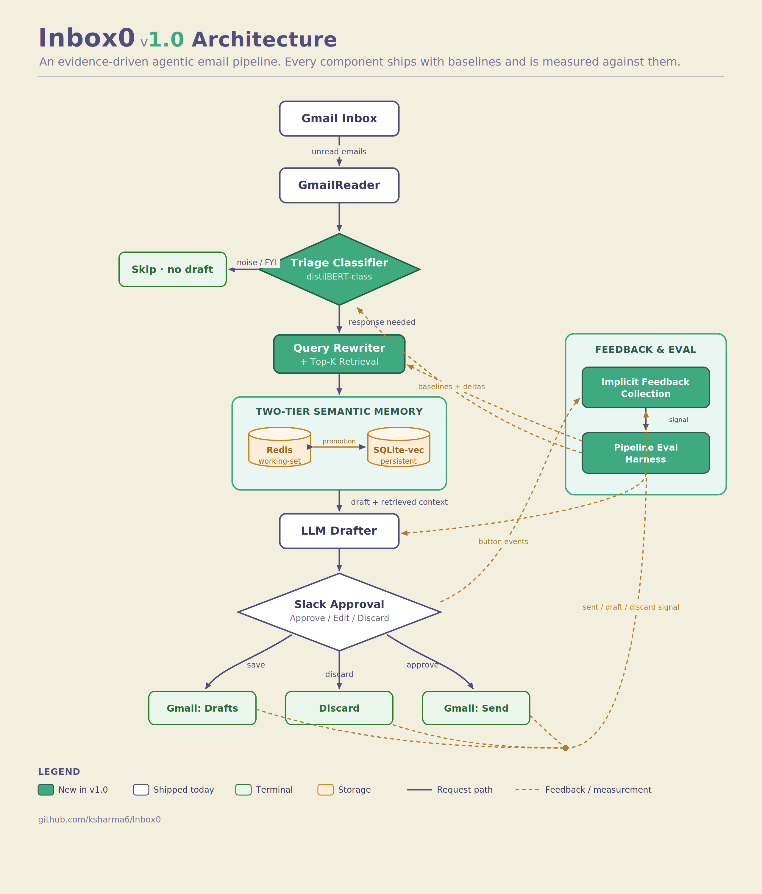

<p align="center">
  
</p>

<p align="center">
  <a href="https://github.com/ksharma6/Inbox0/actions/workflows/ci.yml"></a>
  <!-- <a href="https://codecov.io/gh/ksharma6/Inbox0"></a> -->
  <a href="https://python.org"></a>
  <a href="LICENSE"></a>
  <a href="https://langchain-ai.github.io/langgraph/"></a>
  <a href="https://smith.langchain.com"></a>
  <a href="https://slack.com"></a>
  <a href="https://openrouter.ai"></a>
  <a href="https://gmail.com"></a>
</p>

## Inbox0 — AI Email Assistant

An AI assistant that reads your Gmail, summarizes your day’s to‑dos, and drafts responses for human review in Slack. Runs a Flask server with Slack actions and a LangGraph workflow that orchestrates Gmail + OpenRouter. Compatible with OpenRouter and any OpenAI SDK-compatible provider.

## Features

### Intelligent Email Triage

- **Smart Summarization**: Automatically reads your recent unread emails and generates a high-level daily summary, highlighting key themes and urgent items.

<p align="center">
  
</p>

- **Actionable Insights**: Analyzes each email to determine if a response is required, filtering out spam and promotional content while flagging important messages from clients or colleagues.

### AI-Powered Drafting

- **Flexible LLM Support**: Works with any model available via [OpenRouter](https://openrouter.ai) or any provider compatible with the OpenAI SDK — swap models by changing a single environment variable. Drafts professional replies based on the original email's context, tone, and priority.

- **Customizable Persona**: configurable salutations and sign-offs to match your personal style.

- **Smart Routing**: Determines whether a `Reply`, `Forward`, or `New Email` is the appropriate action.

### Slack-Based Workflow (Human-in-the-Loop)

- **Interactive Approvals**: Sends generated drafts directly to Slack as interactive messages.

- **One-Click Actions**:

  - ✅ **Approve & Send**: Immediately sends the email via Gmail.

  - ❌ **Reject**: Discards the draft.

  - 💾 **Save Draft**: Saves it to your Gmail Drafts folder for later editing.

  - **State Management**: The workflow pauses for your input and seamlessly resumes after you take action. 

<p align="center">
  
</p>

### Seamless Orchestration

- **LangGraph Architecture**: Built on a robust state machine that manages the flow between Gmail reading, AI processing, and Slack user interaction.

- **Secure Integration**: Runs locally with your own API keys, keeping your data private and secure.

### Quick start

1. Prerequisites

- Python 3.11+
- Google OAuth setup (Gmail)
  - In Google Cloud Console: enable Gmail API
  - Create OAuth client credentials and download `credentials.json`
  - Place `credentials.json` in the directory pointed to by `TOKENS_PATH`
  - First run will perform OAuth and create `token.json` in the same folder
- A Slack App (Bot) installed to your workspace
- An API key for your chosen LLM provider — any model available through [OpenRouter](https://openrouter.ai) or compatible with the OpenAI SDK is supported

1. Clone and install

```bash
# Install uv if you haven't already
curl -LsSf https://astral.sh/uv/install.sh | sh

# Install all dependencies
uv sync --group dev
```

1. Configure environment

- Create a `.env` file in the project root with the following keys:

```
OPENROUTER_API_KEY=your-api-key          # or your provider's API key
OPENROUTER_MODEL=openai/gpt-4o           # any OpenRouter or OpenAI SDK-compatible model
OPENROUTER_BASE_URL=https://openrouter.ai/api/v1  # override for other providers
LANGSMITH_API_KEY=your-langsmith-api-key # from https://smith.langchain.com — used for LangGraph tracing
SLACK_BOT_TOKEN=xoxb-...
SLACK_SIGNING_SECRET=...
# Protects /start_workflow and /resume_workflow. Generate with: openssl rand -hex 32
INBOX0_API_KEY=your-generated-workflow-api-key
# Stable label for the Gmail account this API key controls
INBOX0_GMAIL_ACCOUNT_ID=personal-gmail
# Slack member ID that receives draft approval DMs
INBOX0_SLACK_USER_ID=U12345678
# Absolute path to the tokens folder that contains Gmail OAuth files (must end with a trailing slash)
TOKENS_PATH=/absolute/path/to/Inbox0/tokens/
```

1. Slack App setup

- Create a Slack App (from scratch) and add a Bot user
- OAuth scopes (typical):
  - chat:write
  - im:write
  - users:read
- Interactivity & Shortcuts: enable and set Request URL to `<your-public-url>/slack/actions`
- Event Subscriptions: enable and set Request URL to `<your-public-url>/slack/events`
- Install the app to your workspace and copy the Bot Token and Signing Secret into `.env`
- For local development, use a tunneling tool (e.g., ngrok) to expose `http://localhost:5002`

1. Run the server

```bash
uv run python main.py
# Server listens on http://localhost:5002
```

### API endpoints

- POST `/start_workflow`
  - Header: `X-Inbox0-API-Key: <INBOX0_API_KEY>`
  - Body: `{}`
  - Starts the LangGraph workflow. Returns `{"status": "paused", "awaiting_approval": true}` when waiting on Slack approval, or `{"status": "completed", ...}` when it finishes in one pass.
- POST `/resume_workflow`
  - Header: `X-Inbox0-API-Key: <INBOX0_API_KEY>`
  - Body: `{ "workflow_run_id": "workflow-run-id-from-start", "action": "approve_draft"|"reject_draft"|"save_draft" }`
  - Resumes the workflow after a Slack action when needed.

Slack endpoints used by the app

- `/slack/events` — Slack Events API entrypoint
- `/slack/actions` — Interactivity actions (buttons) entrypoint

### Configuration notes

- `.env` is loaded at runtime. Ensure it exists at the project root before starting the app.
- `TOKENS_PATH` must be an absolute path and end with a trailing slash. It should contain `credentials.json` and will be where `token.json` is created.
- `INBOX0_API_KEY` is a local workflow API secret. Generate it with `openssl rand -hex 32` and send it as the `X-Inbox0-API-Key` header when calling protected workflow routes.
- `INBOX0_GMAIL_ACCOUNT_ID` is a stable server-side label for the Gmail account this API key controls, such as `personal-gmail`.
- `INBOX0_SLACK_USER_ID` is the Slack member ID that receives draft approval DMs. In Slack, open your profile, choose the more actions menu, then copy your member ID.
- The Flask server defaults to port `5002`.
- `LANGSMITH_API_KEY` enables LangGraph tracing via [LangSmith](https://smith.langchain.com). Create a free account, generate an API key, and set `LANGCHAIN_TRACING_V2=true` in your `.env` to activate tracing.

### Project structure (high level)

```
Inbox0/
  main.py                    # Flask + Slack app bootstrap
  src/
    agent/agent.py           # Tool-calling agent (OpenRouter + OpenAI SDK-compatible)
    gmail/
      gmail_authenticator.py # OAuth flow (credentials.json/token.json)
      gmail_reader.py        # Read/search Gmail
      gmail_writer.py        # Create/send/save drafts
    models/                  # Pydantic schemas (agent, gmail, slack, tool functions)
    routes/
      web/flask_routes.py                # /start_workflow, /resume_workflow
      integrations_slack/slack_routes.py # /slack/events, /slack/actions
    slack_handlers/
      draft_approval_handler.py  # Slack interactive approvals
      slack_authenticator.py     # Slack auth helpers
      workflow_bridge.py         # Resume workflow after Slack action
    utils/                   # .env loading, usage tracking, JSON log formatting
    workflows/
      workflow.py            # EmailProcessingWorkflow (LangGraph graph)
      factory.py             # Wiring Gmail, Slack, LLM
      state_manager.py       # Persist/restore workflow state
  tests/                     # pytest suite mirroring the src/ layout
```

### How it works (architecture)

<p align="center">
  
</p>

1. Client calls `/start_workflow` with `X-Inbox0-API-Key`
2. `EmailProcessingWorkflow`:
  - reads unread emails
  - summarizes, analyzes, and drafts responses using your configured LLM (any OpenRouter or OpenAI SDK-compatible model)
  - builds Gmail drafts from the generated responses
  - sends each draft to Slack via `DraftApprovalHandler` with Approve/Reject/Save buttons
  - pauses while waiting for user action (state is saved)
3. When the user clicks a Slack button, the app resumes via `/slack/actions` → internal resume logic → `/resume_workflow`
4. After all drafts are handled, a final summary is posted and the workflow completes

### Example requests

Start workflow

```bash
curl -X POST http://localhost:5002/start_workflow \
  -H 'Content-Type: application/json' \
  -H "X-Inbox0-API-Key: $INBOX0_API_KEY" \
  -d '{}'
```

Resume after an approval (usually triggered internally from Slack)

```bash
curl -X POST http://localhost:5002/resume_workflow \
  -H 'Content-Type: application/json' \
  -H "X-Inbox0-API-Key: $INBOX0_API_KEY" \
  -d '{"workflow_run_id":"workflow-run-id-from-start","action":"approve_draft"}'
```

### Roadmap

Inbox0 is in active development toward **v1.0**, which establishes the project as *an intelligent system that improves by evidence rather than intuition*. Each component ships with baselines and benchmarks, and every change downstream is evaluated against them. Features land when they demonstrate measurable improvement, not when they feel done.

Four components ship together:

- **Triage classifier** — a lightweight gate that decides which emails warrant a drafted response, dropping cost and latency on inbox noise before the expensive LLM runs. Tracked in [#47](https://github.com/ksharma6/Inbox0/issues/47).
- **Long/short-term semantic memory** — a two-tier retrieval layer giving the agent access to the rich context in the user's inbox, across both years of history (SQLite-vec persistent store) and the current week's active work (Redis working-set cache with last-access TTL). Tracked in [#17](https://github.com/ksharma6/Inbox0/issues/17).
- **Pipeline evaluation harness** — tracks draft quality, triage accuracy, retrieval relevance, cost, latency, and token usage across the full pipeline. Establishes baselines on every component, runs on every change, and ingests implicit feedback as continuous quality signal. Tracked in [#TBD].
- **Implicit feedback collection** — instruments the Slack approval flow plus Gmail folder state to measure user satisfaction without asking. Tracks whether each draft was sent, how much it was edited before sending, and distinguishes drafter failures from classifier failures on discards. Tracked in [#TBD].

Track v1.0 progress at the [v1.0 milestone page](https://github.com/ksharma6/Inbox0/milestone/1).

#### v1.0 system architecture

<p align="center">
  
</p>

The diagram shows the v1.0 target. Components in teal are new; gray are shipped today. Solid arrows are the request path; dashed arrows are the feedback and measurement path.

#### Beyond v1.0

The longer-term direction is an agent that learns to read, write, and make decisions like its user. Every email the user has written is signal for their voice; every prior decision is signal for their judgment. The semantic memory layer is the substrate that makes user-voice modeling possible in future releases.

### Troubleshooting

- Slack 401/invalid signature: verify `SLACK_SIGNING_SECRET` and external URLs for `/slack/actions` and `/slack/events`
- Cannot DM the user: ensure the bot is installed and has `im:write`; use a valid Slack user ID (e.g., starts with `U`)
- Gmail errors: confirm `credentials.json` exists at `TOKENS_PATH` and re‑run to regenerate `token.json` if needed
- No .env loaded: ensure `.env` exists at project root and environment variable keys are set before `python main.py`
- `TOKENS_PATH` must end with `/` so the app finds `token.json` and `credentials.json`
- Missing `LANGSMITH_API_KEY`: create a free account at [smith.langchain.com](https://smith.langchain.com), generate an API key under Settings, and add it to `.env`

### Security

- Do not commit `credentials.json` or `token.json`
- Keep API keys in `.env` or your secret manager

