<p align="center">
  
</p>

## Inbox0 — AI Email Assistant

An AI assistant that reads your Gmail, summarizes your day’s to‑dos, and drafts responses for human review in Slack. Runs a Flask server with Slack actions and a LangGraph workflow that orchestrates Gmail + OpenAI. At this time, the project only supports calls to OpenAI's API. 

## Features

### Intelligent Email Triage

- **Smart Summarization**: Automatically reads your recent unread emails and generates a high-level daily summary, highlighting key themes and urgent items.

<p align="center">
  
</p>

- **Actionable Insights**: Analyzes each email to determine if a response is required, filtering out spam and promotional content while flagging important messages from clients or colleagues.

### AI-Powered Drafting

- **Flexible LLM Support**: Works with any model available via [OpenRouter](https://openrouter.ai) or any provider compatible with the OpenAI SDK — swap models by changing a single environment variable. Drafts professional replies based on the original email's context, tone, and priority.

- **Customizable Persona**: configurable salutations and sign-offs to match your personal style.

- **Smart Routing**: Determines whether a `Reply`, `Forward`, or `New Email` is the appropriate action.

### Slack-Based Workflow (Human-in-the-Loop)

- **Interactive Approvals**: Sends generated drafts directly to Slack as interactive messages.

- **One-Click Actions**:

  - ✅ **Approve & Send**: Immediately sends the email via Gmail.

  - ❌ **Reject**: Discards the draft.

  - 💾 **Save Draft**: Saves it to your Gmail Drafts folder for later editing.

  - **State Management**: The workflow pauses for your input and seamlessly resumes after you take action. 

<p align="center">
  
</p>

### Seamless Orchestration

- **LangGraph Architecture**: Built on a robust state machine that manages the flow between Gmail reading, AI processing, and Slack user interaction.

- **Secure Integration**: Runs locally with your own API keys, keeping your data private and secure.

### Quick start

1. Prerequisites

- Python 3.11+
- Google OAuth setup (Gmail)
  - In Google Cloud Console: enable Gmail API
  - Create OAuth client credentials and download `credentials.json`
  - Place `credentials.json` in the directory pointed to by `TOKENS_PATH`
  - First run will perform OAuth and create `token.json` in the same folder
- A Slack App (Bot) installed to your workspace
- An API key for your chosen LLM provider — any model available through [OpenRouter](https://openrouter.ai) or compatible with the OpenAI SDK is supported

1. Clone and install

```bash
python -m venv .venv && source .venv/bin/activate
pip install -r requirements.txt
# If anything is missing, also install:
pip install flask slack_bolt slack_sdk python-dotenv langgraph bs4 openai pydantic
```

1. Configure environment

- Create a `.env` file in the project root with the following keys:

```
OPENROUTER_API_KEY=your-api-key          # or your provider's API key
OPENROUTER_MODEL=openai/gpt-4o           # any OpenRouter or OpenAI SDK-compatible model
OPENROUTER_BASE_URL=https://openrouter.ai/api/v1  # override for other providers
SLACK_BOT_TOKEN=xoxb-...
SLACK_SIGNING_SECRET=...
# Absolute path to the tokens folder that contains Gmail OAuth files (must end with a trailing slash)
TOKENS_PATH=/absolute/path/to/inbox_zero/tokens/
```

1. Slack App setup

- Create a Slack App (from scratch) and add a Bot user
- OAuth scopes (typical):
  - chat:write
  - im:write
  - users:read
- Interactivity & Shortcuts: enable and set Request URL to `<your-public-url>/slack/actions`
- Event Subscriptions: enable and set Request URL to `<your-public-url>/slack/events`
- Install the app to your workspace and copy the Bot Token and Signing Secret into `.env`
- For local development, use a tunneling tool (e.g., ngrok) to expose `http://localhost:5002`

1. Run the server

```bash
python main.py
# Server listens on http://localhost:5002
```

### API endpoints

- POST `/start_workflow`
  - Body: `{ "user_id": "U123ABC" }` (Slack user ID to DM approval requests)
  - Starts the LangGraph workflow. Returns `{"status": "paused", "awaiting_approval": true}` when waiting on Slack approval, or `{"status": "completed", ...}` when it finishes in one pass.
- POST `/resume_workflow`
  - Body: `{ "user_id": "U123ABC", "action": "approve_draft"|"reject_draft"|"save_draft" }`
  - Resumes the workflow after a Slack action when needed.

Slack endpoints used by the app

- `/slack/events` — Slack Events API entrypoint
- `/slack/actions` — Interactivity actions (buttons) entrypoint

### Configuration notes

- `.env` is loaded at runtime. Ensure it exists at the project root before starting the app.
- `TOKENS_PATH` must be an absolute path and end with a trailing slash. It should contain `credentials.json` and will be where `token.json` is created.
- The Flask server defaults to port `5002`.

### Project structure (high level)

```
inbox_zero/
  main.py                    # Flask + Slack app bootstrap
  src/
    agent/
      agent.py               # Tool-calling agent (OpenRouter + OpenAI SDK-compatible)
    gmail/
      gmail_authenticator.py # OAuth flow (credentials.json/token.json)
      gmail_reader.py        # Read/search Gmail
      gmail_writer.py        # Create/send/save drafts
      GCalendar.py           # Google Calendar integration helpers
    models/
      agent_schemas.py       # Pydantic schemas for Agent
      gmail.py               # Gmail-related models
      slack.py               # Slack-related models
      toolfunction.py        # Tool/function schema models
    routes/
      web/
        flask_routes.py      # /start_workflow, /resume_workflow
      integrations_slack/
        slack_routes.py      # /slack/events, /slack/actions
    slack_handlers/
      draft_approval_handler.py  # Slack interactive approvals
      slack_authenticator.py     # Slack auth helpers
      workflow_bridge.py         # Resume workflow after Slack action
    utils/
      load_env.py            # .env loader
      usage_tracker.py       # LLM usage tracking
    workflows/
      workflow.py            # EmailProcessingWorkflow (LangGraph graph)
      workflow_factory.py    # Wiring Gmail, Slack, LLM
      factory.py             # Helper factory utilities
      state_manager.py       # Persist/restore workflow state
  tests/
    agent/
      test_agent.py
    logging/
      test_slack_routes.py
      test_draft_approval_handler_logging.py
      test_main_logging_setup.py
```

### How it works (architecture)

<p align="center">
  
</p>

1. Client calls `/start_workflow` with a Slack `user_id`
2. `EmailProcessingWorkflow`:
  - reads unread emails
  - summarizes, analyzes, and drafts responses using your configured LLM (any OpenRouter or OpenAI SDK-compatible model)
  - builds Gmail drafts from the generated responses
  - sends each draft to Slack via `DraftApprovalHandler` with Approve/Reject/Save buttons
  - pauses while waiting for user action (state is saved)
3. When the user clicks a Slack button, the app resumes via `/slack/actions` → internal resume logic → `/resume_workflow`
4. After all drafts are handled, a final summary is posted and the workflow completes

### Example requests

Start workflow

```bash
curl -X POST http://localhost:5002/start_workflow \
  -H 'Content-Type: application/json' \
  -d '{"user_id":"U123ABC"}'
```

Resume after an approval (usually triggered internally from Slack)

```bash
curl -X POST http://localhost:5002/resume_workflow \
  -H 'Content-Type: application/json' \
  -d '{"user_id":"U123ABC","action":"approve_draft"}'
```

### Troubleshooting

- Slack 401/invalid signature: verify `SLACK_SIGNING_SECRET` and external URLs for `/slack/actions` and `/slack/events`
- Cannot DM the user: ensure the bot is installed and has `im:write`; use a valid Slack user ID (e.g., starts with `U`)
- Gmail errors: confirm `credentials.json` exists at `TOKENS_PATH` and re‑run to regenerate `token.json` if needed
- No .env loaded: ensure `.env` exists at project root and environment variable keys are set before `python main.py`
- `TOKENS_PATH` must end with `/` so the app finds `token.json` and `credentials.json`

### Security

- Do not commit `credentials.json` or `token.json`
- Keep API keys in `.env` or your secret manager

