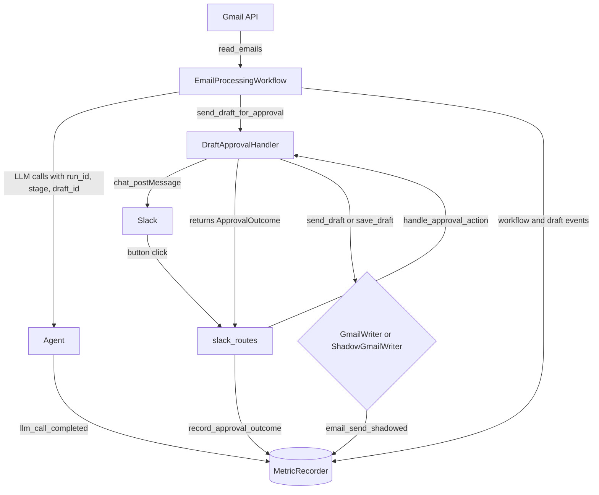

# 002 — Shadow Mode: Collection-Only Evaluation Layer

**Status:** Proposed
**Date:** 2026-05-17

---

## Context

[001-gold_metrics.md](001-gold_metrics.md) commits Inbox0 to scoring v1.0 on three system-level signals (send rate, latency, and cost per draft) and to growing a labeled dataset toward 50 calibration examples before any threshold becomes load-bearing. None of that is reachable without a way to run the real pipeline on a real inbox and capture the outcomes durably, without sending email into the wild every time the agent thinks it should.

Today the gold-metric inputs are scattered:

- Slack button-click events live as log lines.
- Workflow state is pickled to memory or a file by `StateManager`.
- LLM token usage is appended to `usage_tracker.json` with `timestamp`, `model`, `prompt_tokens`, `completion_tokens` — no `workflow_run_id`, no `draft_id`, no stage label.
- "Draft surfaced in Slack" and "email arrived" timestamps exist only as the byproduct of `chat_postMessage` and `email.date`, which is the sender's clock, not Inbox0's ingest time.

These can't be joined into a per-draft record without a measurement layer that exists before the components it scores. Shadow mode is that layer. This ADR scopes the **collection layer only**. Reporters, edit-distance gates, and the LLM-judge threshold calibration described in 001 are explicit follow-ons.

---

## Goals

1. Run the existing workflow against a real inbox with one safety property: **no email is sent**, even when the user clicks "Approve".
2. Emit a durable, append-only record of every event needed to compute send rate, per-draft latency, per-batch latency, and per-draft cost from offline data alone.
3. Be invisible to the user. The only visible difference between live and shadow mode is the button copy (the `Would …` framing); behavior the user can see — drafts generated and shown for review — is unchanged.
4. Be instrumentation, not a fork. No parallel `DraftApprovalHandler`, no second workflow class, no copy-paste of the approval flow.

## Non-goals

- Computing the gold metrics inside the app. The math from 001 (cost rates, edit distance, LLM judge) lives in the offline harness.
- Replacing `UsageTracker`. It coexists with `MetricRecorder` in this PR; collapsing them is a separate cleanup.
- A pricing table. Tokens and model name are recorded; `(tokens × rate)` is the harness's job so a stale price doesn't get baked into the runtime.
- File rotation for `metrics/*.jsonl`. Start unbounded; revisit when volume warrants.

---

## What gets shadowed and what stays live

The Gmail-side actions split three ways:

| Action          | Live behavior                              | Shadow behavior                                            |
|-----------------|--------------------------------------------|------------------------------------------------------------|
| `send_draft`    | `messages().send()` — email leaves         | **No-op.** Return `{"id": "shadow_msg_<uuid>"}`. Emit event |
| `send_reply`    | `messages().send()` — email leaves         | **No-op.** Same shape as above                              |
| `save_draft`    | `drafts().create()` — drafts folder write  | **No-op.** Record `would_save` intent only; no folder write |
| `create_draft`  | Local base64 encode, no API call           | Unchanged                                                   |

Shadow mode touches Gmail for nothing: both send paths and the save path are intercepted, so the only Gmail interaction is the read at the top of the workflow. `create_draft` stays live because it is a pure local base64 encode with no API call — it produces the draft body the user reviews, but never reaches Gmail.

This is a deliberate change from an earlier cut that kept `save_draft` live to harvest a real Gmail draft ID for edit distance. Edit distance now belongs entirely to the [003 harness](003-eval_harness.md) (retrospective replay and live folder polling), so shadow mode no longer needs a live save, and a fully side-effect-free shadow mode is simpler to reason about and matches the uniform `Would …` button framing.

Reject has no Gmail side effect in either mode.

---

## How the layer plugs in



Four pieces hold this together:

1. **`AppMode` flag.** Read from `INBOX0_SHADOW_MODE` at boot. Default `LIVE`.
2. **`ShadowGmailWriter`.** Subclass of `GmailWriter` that overrides the three write paths — `send_draft`, `send_reply`, and `save_draft` — to no-op and emit an event. The factory injects this instead of `GmailWriter` when the flag is on.
3. **`ApprovalOutcome` boundary type.** `DraftApprovalHandler.handle_approval_action` returns an outcome object instead of `None`. The Slack route layer translates it into a `MetricRecorder.record_approval_outcome(outcome)` call. The handler stays focused on Slack; persistence lives in the eval layer.
4. **`MetricRecorder`.** Append-only JSONL sink at `metrics/events.jsonl`. One method `record(event_name, **fields)` plus typed helpers per event.

The factory wires all of this. Without `INBOX0_SHADOW_MODE` set, the wiring resolves to today's exact dependency graph minus the (cheap, optional) recorder calls.

---

## Module layout

New code lives under `src/eval/`:

- `app_mode.py` — `AppMode(LIVE, SHADOW)`; `get_app_mode()` reads `INBOX0_SHADOW_MODE`.
- `metric_recorder.py` — append-only JSONL sink. Side-effect-isolated so retries are safe per [reliability/001](../reliability/001-idempotent-write-side-retry-strategy-for-mail-and-slack.md).
- `metric_events.py` — frozen Pydantic models for `WorkflowStarted`, `EmailIngested`, `DraftSurfaced`, `ApprovalOutcomeRecorded`, `LLMCallCompleted`, `EmailSendShadowed`, `WorkflowCompleted`. All carry `workflow_run_id`; event-specific events also carry `draft_id` and/or `email_id` and `thread_id`.
- `approval_outcome.py` — frozen dataclass with `workflow_run_id`, `draft_id`, `slack_user_id`, `email_id`, `thread_id`, `action: ResumeAction`, `user_intent: Literal["would_send", "would_save", "would_reject"]`, `success`, `gmail_message_id`, `gmail_draft_id`, `error`, `timestamp`. In shadow mode `gmail_message_id` and `gmail_draft_id` are the synthetic `shadow_*` IDs, since no real send or save occurs.
- `shadow_gmail_writer.py` — subclass of `GmailWriter`. Overrides `send_draft`, `send_reply`, and `save_draft`.

Touched code:

- `src/workflows/factory.py` — mode-aware wiring.
- `src/slack_handlers/draft_approval_handler.py` — return `ApprovalOutcome`; accept `app_mode` and use it to choose the Send button label; stash `email_id` and `thread_id` in `pending_drafts[draft_id]` so the outcome can carry them.
- `src/routes/integrations_slack/slack_routes.py` — call `recorder.record_approval_outcome(outcome)` between the handler call and `resume_workflow_after_action(...)`.
- `src/workflows/workflow.py` — emit `workflow_started`, `email_ingested` (per email), `draft_surfaced` (after `chat_postMessage` success), `workflow_completed`.
- `src/agent/agent.py` — `set_context(**kwargs)` / `clear_context()` plus `record_llm_call` emit inside `_timed_completion`.
- `src/utils/usage_tracker.py` — `log_usage` accepts optional `workflow_run_id`, `stage`, `draft_id` (backward-compatible defaults).
- `.env.example` — `INBOX0_SHADOW_MODE=false` with comment.
- `metrics/.gitignore` — ignore `*.jsonl`.

---

## Slack button copy

All three buttons take the `Would …` framing in shadow mode, so the review surface reads uniformly as a "what would you do" prompt rather than a live action bar.

| Action  | Live label           | Shadow label        |
|---------|----------------------|---------------------|
| approve | ✅ Approve & Send    | 👻 Would Send       |
| save    | 💾 Save Draft        | 👻 Would Save Draft |
| reject  | ❌ Reject            | 👻 Would Reject     |

`action_id` and `value` strings are identical in both modes so the route dispatch and `ResumeAction` mapping are unchanged.

The `Would …` framing is now literally accurate: in shadow mode all three actions are intent-only, so no button performs a real Gmail side effect (per the shadow-behavior table above). Self-reported edit magnitude (a follow-up "minor / major edits" prompt) was considered and dropped — see Limitations.

---

## Latency anchors

001 defines latency as "email arrival in Gmail → draft appearing in Slack." The header `Date` is the sender's clock, so the closest defensible anchors Inbox0 owns are:

- `email_first_seen_at` — set when `_read_unread_emails` fetches a message. Recorded on an `email_ingested` event keyed by `email_id`.
- `draft_surfaced_at` — the `chat_postMessage` success in `send_draft_for_approval`. Recorded on a `draft_surfaced` event keyed by `draft_id` + `email_id`.

Per-draft latency = `draft_surfaced.surfaced_at - email_ingested.ingested_at`, joined on `email_id`. Per-batch latency = `workflow_completed.ts - workflow_started.ts`. Both views from 001 are computable.

`time.perf_counter_ns()` for monotonic durations within a process; ISO8601 wall-clock timestamps on every event for cross-process joins.

---

## Storage layout

```
metrics/
├── events.jsonl       # MetricRecorder events
└── llm_calls.jsonl    # extended UsageTracker (now includes workflow_run_id, stage, draft_id)
```

Two files, both append-only JSONL, both joined offline by `workflow_run_id` and `draft_id`. The duplication between `llm_calls.jsonl` and `events.jsonl[event=llm_call_completed]` is intentional in this PR: `usage_tracker.json` already exists and other code reads it; one of the two will get collapsed in a follow-on cleanup once nothing else depends on the old shape.

---

## What this PR does not include

These are deferred to follow-on PRs and tracked separately so this collection layer can ship small:

- Offline reporter that reads `events.jsonl` and prints send-rate / latency p50,p95 / cost per draft.
- Edit-distance gates (token Levenshtein, semantic cosine) from 001.
- LLM-judge threshold calibration loop from 001.
- Pricing table for cost-per-draft math.
- File rotation policy for `metrics/*.jsonl`.
- Migration of `UsageTracker` callers onto `MetricRecorder`.

---

## Limitations: shadow mode is a cold-start instrument, not the harness

First, what shadow mode earns outright: **latency and cost per draft are fully measured here, with no caveat.** Both are read from the real pipeline executing — per-stage token counts and wall-clock from ingest to draft-surfaced — and neither depends on whether a send happens or on what the user clicks. Two of the three gold metrics are therefore first-class in shadow mode.

The limitation is the third. The send rate (and the edit distance folded into it) in [001](001-gold_metrics.md) is defined as an **outcome** signal: was the email *sent*, how much did the user *change* it before sending. Shadow mode, by design, intercepts the consequence. So it can only ever collect **intent** — a `Would Send` click, not a sent email. That gap is real and worth stating plainly:

- **Intent overestimates send rate, but in a known direction.** Clicking `Would Send` costs nothing. Under zero stakes the user rubber-stamps drafts that are merely "good enough" — ones they would tighten or kill if the email were actually going out under their name. This low-stakes bias is systematic and *optimistic*: it inflates the rate rather than scrambling it. That directionality is what makes the signal salvageable — shadow-mode send rate is an upper bound now, and once the [003 harness](003-eval_harness.md) produces real sends, the gap between `Would Send` rate and true send rate can be estimated and shadow data carried forward as a debiased estimator rather than discarded.
- **Edit distance is uncapturable in shadow mode entirely.** Because both send and save are no-ops, nothing reaches Gmail — there is no sent body and no saved draft to diff the generated draft against. The richest cell in the 001 rubric — "sent as-is vs heavily rewritten" — is simply not observable here. It is recovered in the [003 harness](003-eval_harness.md), via retrospective replay against real sent mail and, later, live folder polling.
- **The "Save-then-what" branches collapse.** 001's rubric forks on downstream behavior (saved → sent as-is = pass; saved → never sent but manual reply = fail/drafter). Those events all occur *after* the button and require a real Gmail draft. Shadow mode truncates observation at the click.

A consequence worth recording for the button design: self-reported edit magnitude (e.g. a follow-up "minor edits / major edits" prompt) was considered and rejected. A prospective, subjective self-report is a noisy proxy for a number the 003 harness can compute precisely from drafted-vs-sent diffs. Shadow mode keeps three plain buttons (`Would Send`, `Would Save`, `Would Reject`), captures intent only, and defers all edit-magnitude measurement to the harness.

**One conflation to avoid.** Shadow mode's "first 50 samples" are not the same 50 that 001 calibrates thresholds on. 001's calibration is run explicitly on the first ~50 *drafted-vs-sent pairs* — it needs a sent body to diff and judge. Shadow mode produces drafted-*only* samples (`{draft, context, intent, latency, cost}`), because nothing is ever sent. Those are a real dataset and a real head start — enough to baseline latency and cost and to eyeball draft quality with a judge that scores the draft in isolation — but they are a different corpus serving a different job than the drafted-vs-sent pairs the send-rate gates require. Treating the shadow 50 as if it clears 001's calibration bar would claim a gate that has not been passed; the drafted-vs-sent corpus comes from 003.

The conclusion: shadow mode is genuinely good at exactly one thing — **cold start with zero risk.** It nails latency and cost, captures intent as a deliberately optimistic (and later debiasable) upper bound, and refuses to manufacture a behavioral signal — saved drafts included — that zero stakes would only contaminate. It produces an initial intent-labeled set so the harness does not begin from an empty table. It is not, and should not be treated as, the evaluation harness. The behavioral ground truth lives in [003-eval_harness.md](003-eval_harness.md): retrospective replay against the user's own sent mail for a deterministic, repeatable gold target, graduating to live mode plus Gmail folder polling for the true send-rate and edit-distance signals.

---

## Relationship to other ADRs

- [evaluation/001-gold_metrics.md](001-gold_metrics.md) — defines what gets measured. This ADR builds the collection surface that makes those measurements computable. The `Capture surface` table in 001 maps cleanly onto the events emitted here.
- [evaluation/003-eval_harness.md](003-eval_harness.md) — the actual evaluation engine. Shadow mode is the cold-start bootstrap that seeds it; 003 owns the deterministic replay and live-observation paths that produce the outcome-defined gold metrics shadow mode cannot.
- [reliability/001-idempotent-write-side-retry-strategy-for-mail-and-slack.md](../reliability/001-idempotent-write-side-retry-strategy-for-mail-and-slack.md) — `MetricRecorder.record` must be side-effect-isolated and safely repeatable; this ADR honors that by writing to JSONL and avoiding any cross-event state.

---

## Open questions

1. ~~Should all three buttons say `Would …` in shadow mode?~~ **Resolved:** yes. All three use the `Would …` framing for a uniform review surface, and in shadow mode all three are intent-only (no Gmail side effect), so the framing is literally accurate.
2. Should `email_ingested` events fire per-email or per-batch with a list? Per-email is simpler to join; per-batch is cheaper at high volume. Default: per-email until volume forces a change.
3. When `INBOX0_SHADOW_MODE` is unset, do we still construct a `MetricRecorder` and emit events (so the harness can backfill from live data later), or skip emission entirely? Default proposed: still construct, still emit. The recorder is cheap and the parallelism is the whole point.

---

## Decision

Implement shadow mode as a five-module evaluation layer under `src/eval/` plus a small number of returning-an-outcome changes to existing handlers. The flag is `INBOX0_SHADOW_MODE`, defaults off. When on, the three Gmail write paths (`send_draft`, `send_reply`, `save_draft`) become no-ops and the approval buttons take the `Would …` framing; shadow mode touches Gmail only for the read at the top of the workflow. Everything else — drafts generated, drafts shown for review, LLM calls made — runs the live code path so the metrics collected reflect the live system, not a diagnostic of itself. Edit distance and true send rate, which require a real Gmail side effect, are explicitly out of scope here and belong to the [003 harness](003-eval_harness.md).
