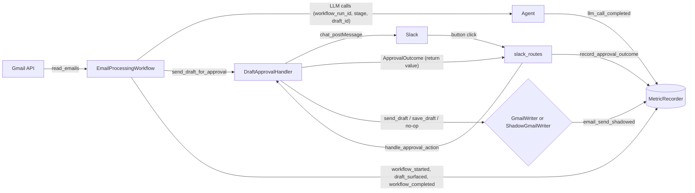

# 002 — Shadow Mode: Collection-Only Evaluation Layer

**Status:** Proposed
**Date:** 2026-05-17

---

## Context

[001-gold_metrics.md](001-gold_metrics.md) commits Inbox0 to scoring v1.0 on three system-level signals — send rate, latency, and cost per draft — and to growing a labeled dataset toward 50 calibration examples before any threshold becomes load-bearing. None of that is reachable without a way to run the real pipeline on a real inbox and capture the outcomes durably, without sending email into the wild every time the agent thinks it should.

Today the gold-metric inputs are scattered:

- Slack button-click events live as log lines.
- Workflow state is pickled to memory or a file by `StateManager`.
- LLM token usage is appended to `usage_tracker.json` with `timestamp`, `model`, `prompt_tokens`, `completion_tokens` — no `workflow_run_id`, no `draft_id`, no stage label.
- "Draft surfaced in Slack" and "email arrived" timestamps exist only as the byproduct of `chat_postMessage` and `email.date`, which is the sender's clock, not Inbox0's ingest time.

These can't be joined into a per-draft record without a measurement layer that exists before the components it scores. Shadow mode is that layer. This ADR scopes the **collection layer only**. Reporters, edit-distance gates, and the LLM-judge threshold calibration described in 001 are explicit follow-ons.

---

## Goals

1. Run the existing workflow against a real inbox with one safety property: **no email is sent**, even when the user clicks "Approve".
2. Emit a durable, append-only record of every event needed to compute send rate, per-draft latency, per-batch latency, and per-draft cost from offline data alone.
3. Be invisible to the user. The only visible difference between live and shadow mode is one button label.
4. Be instrumentation, not a fork. No parallel `DraftApprovalHandler`, no second workflow class, no copy-paste of the approval flow.

## Non-goals

- Computing the gold metrics inside the app. The math from 001 (cost rates, edit distance, LLM judge) lives in the offline harness.
- Replacing `UsageTracker`. It coexists with `MetricRecorder` in this PR; collapsing them is a separate cleanup.
- A pricing table. Tokens and model name are recorded; `(tokens × rate)` is the harness's job so a stale price doesn't get baked into the runtime.
- File rotation for `metrics/*.jsonl`. Start unbounded; revisit when volume warrants.

---

## What gets shadowed and what stays live

The Gmail-side actions split three ways:

| Action          | Live behavior                              | Shadow behavior                                            |
|-----------------|--------------------------------------------|------------------------------------------------------------|
| `send_draft`    | `messages().send()` — email leaves         | **No-op.** Return `{"id": "shadow_msg_<uuid>"}`. Emit event |
| `send_reply`    | `messages().send()` — email leaves         | **No-op.** Same shape as above                              |
| `save_draft`    | `drafts().create()` — drafts folder write  | **Unchanged.** Real Gmail draft is created                  |
| `create_draft`  | Local base64 encode, no API call           | Unchanged                                                   |

`save_draft` is deliberately not shadowed. A Gmail draft has no recipient impact, and keeping it live gives the eval harness a real Gmail draft ID to join against (useful later when computing edit distance between drafted body and sent body from the harness's polling of `Sent`/`Drafts` folders, per the "Capture surface" table in 001).

Reject has no Gmail side effect in either mode.

---

## How the layer plugs in



Four pieces hold this together:

1. **`AppMode` flag.** Read from `INBOX0_SHADOW_MODE` at boot. Default `LIVE`.
2. **`ShadowGmailWriter`.** Subclass of `GmailWriter` that overrides `send_draft` and `send_reply` only. The factory injects this instead of `GmailWriter` when the flag is on.
3. **`ApprovalOutcome` boundary type.** `DraftApprovalHandler.handle_approval_action` returns an outcome object instead of `None`. The Slack route layer translates it into a `MetricRecorder.record_approval_outcome(outcome)` call. The handler stays focused on Slack; persistence lives in the eval layer.
4. **`MetricRecorder`.** Append-only JSONL sink at `metrics/events.jsonl`. One method `record(event_name, **fields)` plus typed helpers per event.

The factory wires all of this. Without `INBOX0_SHADOW_MODE` set, the wiring resolves to today's exact dependency graph minus the (cheap, optional) recorder calls.

---

## Module layout

New code lives under `src/eval/`:

- `app_mode.py` — `AppMode(LIVE, SHADOW)`; `get_app_mode()` reads `INBOX0_SHADOW_MODE`.
- `metric_recorder.py` — append-only JSONL sink. Side-effect-isolated so retries are safe per [reliability/001](../reliability/001-idempotent-write-side-retry-strategy-for-mail-and-slack.md).
- `metric_events.py` — frozen Pydantic models for `WorkflowStarted`, `EmailIngested`, `DraftSurfaced`, `ApprovalOutcomeRecorded`, `LLMCallCompleted`, `EmailSendShadowed`, `WorkflowCompleted`. All carry `workflow_run_id`; event-specific events also carry `draft_id` and/or `email_id` and `thread_id`.
- `approval_outcome.py` — frozen dataclass with `workflow_run_id`, `draft_id`, `slack_user_id`, `email_id`, `thread_id`, `action: ResumeAction`, `user_intent: Literal["would_send", "save", "would_reject"]`, `success`, `gmail_message_id`, `gmail_draft_id`, `error`, `timestamp`.
- `shadow_gmail_writer.py` — subclass of `GmailWriter`. Overrides `send_draft` and `send_reply` only.

Touched code:

- `src/workflows/factory.py` — mode-aware wiring.
- `src/slack_handlers/draft_approval_handler.py` — return `ApprovalOutcome`; accept `app_mode` and use it to choose the Send button label; stash `email_id` and `thread_id` in `pending_drafts[draft_id]` so the outcome can carry them.
- `src/routes/integrations_slack/slack_routes.py` — call `recorder.record_approval_outcome(outcome)` between the handler call and `resume_workflow_after_action(...)`.
- `src/workflows/workflow.py` — emit `workflow_started`, `email_ingested` (per email), `draft_surfaced` (after `chat_postMessage` success), `workflow_completed`.
- `src/agent/agent.py` — `set_context(**kwargs)` / `clear_context()` plus `record_llm_call` emit inside `_timed_completion`.
- `src/utils/usage_tracker.py` — `log_usage` accepts optional `workflow_run_id`, `stage`, `draft_id` (backward-compatible defaults).
- `.env.example` — `INBOX0_SHADOW_MODE=false` with comment.
- `metrics/.gitignore` — ignore `*.jsonl`.

---

## Slack button copy

Only the Send button is relabeled in shadow mode, since it is the only action being shadowed.

| Action  | Live label           | Shadow label  |
|---------|----------------------|---------------|
| approve | ✅ Approve & Send    | 👻 Would Send |
| save    | 💾 Save Draft        | 💾 Save Draft |
| reject  | ❌ Reject            | ❌ Reject     |

`action_id` and `value` strings are identical in both modes so the route dispatch and `ResumeAction` mapping are unchanged.

**Open for review:** the issue text proposed `Would Save` and `Would Reject` for visual consistency. With `save_draft` left live, that copy is misleading. The proposal here keeps copy honest at the cost of asymmetry. Easy to revisit.

---

## Latency anchors

001 defines latency as "email arrival in Gmail → draft appearing in Slack." The header `Date` is the sender's clock, so the closest defensible anchors Inbox0 owns are:

- `email_first_seen_at` — set when `_read_unread_emails` fetches a message. Recorded on an `email_ingested` event keyed by `email_id`.
- `draft_surfaced_at` — the `chat_postMessage` success in `send_draft_for_approval`. Recorded on a `draft_surfaced` event keyed by `draft_id` + `email_id`.

Per-draft latency = `draft_surfaced.surfaced_at - email_ingested.ingested_at`, joined on `email_id`. Per-batch latency = `workflow_completed.ts - workflow_started.ts`. Both views from 001 are computable.

`time.perf_counter_ns()` for monotonic durations within a process; ISO8601 wall-clock timestamps on every event for cross-process joins.

---

## Storage layout

```
metrics/
├── events.jsonl       # MetricRecorder events
└── llm_calls.jsonl    # extended UsageTracker (now includes workflow_run_id, stage, draft_id)
```

Two files, both append-only JSONL, both joined offline by `workflow_run_id` and `draft_id`. The duplication between `llm_calls.jsonl` and `events.jsonl[event=llm_call_completed]` is intentional in this PR: `usage_tracker.json` already exists and other code reads it; one of the two will get collapsed in a follow-on cleanup once nothing else depends on the old shape.

---

## What this PR does not include

These are deferred to follow-on PRs and tracked separately so this collection layer can ship small:

- Offline reporter that reads `events.jsonl` and prints send-rate / latency p50,p95 / cost per draft.
- Edit-distance gates (token Levenshtein, semantic cosine) from 001.
- LLM-judge threshold calibration loop from 001.
- Pricing table for cost-per-draft math.
- File rotation policy for `metrics/*.jsonl`.
- Migration of `UsageTracker` callers onto `MetricRecorder`.

---

## Relationship to other ADRs

- [evaluation/001-gold_metrics.md](001-gold_metrics.md) — defines what gets measured. This ADR builds the collection surface that makes those measurements computable. The `Capture surface` table in 001 maps cleanly onto the events emitted here.
- [reliability/001-idempotent-write-side-retry-strategy-for-mail-and-slack.md](../reliability/001-idempotent-write-side-retry-strategy-for-mail-and-slack.md) — `MetricRecorder.record` must be side-effect-isolated and safely repeatable; this ADR honors that by writing to JSONL and avoiding any cross-event state.

---

## Open questions

1. Should all three buttons say `Would …` in shadow mode for visual consistency, even though `save_draft` is left live? Current default: relabel Send only.
2. Should `email_ingested` events fire per-email or per-batch with a list? Per-email is simpler to join; per-batch is cheaper at high volume. Default: per-email until volume forces a change.
3. When `INBOX0_SHADOW_MODE` is unset, do we still construct a `MetricRecorder` and emit events (so the harness can backfill from live data later), or skip emission entirely? Default proposed: still construct, still emit. The recorder is cheap and the parallelism is the whole point.

---

## Decision

Implement shadow mode as a five-module evaluation layer under `src/eval/` plus a small number of returning-an-outcome changes to existing handlers. The flag is `INBOX0_SHADOW_MODE`, defaults off, and changes exactly two observable things: `GmailWriter.send_draft` becomes a no-op, and the Send button reads `Would Send`. Everything else — drafts created, drafts shown, drafts saved to Gmail, drafts rejected, LLM calls made — runs the live code path so the metrics collected reflect the live system, not a diagnostic of itself.
