# 003 — Evaluation Harness: Retrospective Replay and Live Observation

**Status:** Proposed
**Date:** 2026-06-05

---

## Context

[001-gold_metrics.md](001-gold_metrics.md) defines the three signals v1.0 is scored on — send rate, latency, cost per draft — and frames them as **outcome** metrics: was the email sent, how much did the user change it, how long did it take, what did it cost. [002-shadow_mode.md](002-shadow_mode.md) builds the collection surface and a zero-risk cold-start instrument, but it is explicit about its own ceiling: shadow mode intercepts the send, so it can only collect **intent** (a `Would Send` click), never the outcome the gold metrics are defined on.

That leaves a gap. Shadow mode seeds an initial dataset, but the thing that actually orders two pipeline variants on the same input — the harness 001 assumes exists "before the components it scores" — has not been designed. This ADR designs it.

The core tension is between **safety** (do not send email into the wild while iterating) and **signal** (the richest gold signal, drafted-vs-sent edit distance, only exists when a real send happens). The resolution is not one mechanism but a progression: start with a deterministic offline target that needs no sending at all, then graduate to live observation once the pipeline earns trust.

---

## Goals

1. Produce a deterministic, repeatable ordering between two pipeline variants (e.g. v1.0 vs v1.1) on an identical input set. This is 001's stated thesis.
2. Score draft quality against a real, human-authored target without requiring a live send.
3. Provide a clean path to the true outcome metrics (real send rate, real edit distance) when the project is ready to let real sends through.
4. Reuse the join keys and event shapes from 002 so shadow-mode data and harness data live in the same schema.

## Non-goals

- Replacing shadow mode. Shadow mode remains the cold-start bootstrap and the live-mode collection surface.
- Defining new gold metrics. This ADR is the engine that computes the three from 001, not a fourth metric.
- Shipping all three tiers at once. Tier 1 (replay) is the first deliverable; tiers 2 and 3 are sketched here so the data model does not have to be reworked later.

---

## The three tiers

```mermaid
flowchart TB
    subgraph t1 [Tier 1: Retrospective Replay - offline, deterministic]
        Sent[User Sent folder] -->|mine reply + reconstruct incoming| Corpus[(Replay corpus)]
        Corpus -->|run pipeline variant| Draft[Generated draft]
        Sent -->|real reply = gold target| Target[Gold target]
        Draft --> Diff[Edit distance + judge]
        Target --> Diff
        Diff --> Report[Variant A vs B ordering]
    end
    subgraph t2 [Tier 2: Live + Folder Polling - true outcomes]
        Live[Live workflow] -->|draft surfaced| Poll[Poll Sent / Drafts]
        Poll -->|drafted vs sent diff| Outcome[Real send rate + edit distance]
    end
    subgraph t3 [Tier 3: Pairwise / Judge - quality decoupled from action]
        Variants[Variant A and B drafts] -->|surface both| Human[User or LLM judge picks]
        Human --> Pref[Direct preference ordering]
    end
```

### Tier 1 — Retrospective replay (first deliverable)

Mine the user's own Sent folder for emails they have *already* replied to. For each, reconstruct the incoming email plus thread context as it existed when they replied, run the pipeline to generate a draft, and compare that draft against the reply the user actually sent.

- **Gold target:** the real, human-authored reply. No self-report, no click.
- **Deterministic:** the corpus is frozen; the same inputs run against any pipeline variant.
- **Repeatable:** v1.0 vs v1.1 on identical inputs is a re-run, not a new data-collection campaign.
- **Zero risk:** nothing is sent; the corpus is historical.

Scoring uses the edit-distance gates already specified in 001 (token-level normalized Levenshtein ≤ 0.20, semantic cosine ≥ 0.92 via `text-embedding-3-small`), plus the gpt-4o intent-preservation judge 001 budgets for threshold calibration.

**Known caveat.** The historical reply was written without the user seeing Inbox0's draft, so it answers "what is a good reply to this email for this user" rather than "what would the user do *with* this specific draft." For ordering draft quality between variants, that target is acceptable and arguably cleaner than an intent click — but it is a different question from the live send rate, and the harness reports it as such.

### Tier 2 — Live mode plus folder polling (true outcomes)

001's own Capture surface table already points here: "Send rate (Gmail outcome): folder polling" and "Edit distance: diff drafted vs sent body." The genuine send rate and genuine edit distance only exist when the email is real and the user acts on it. Because the human is already in the loop reviewing in Slack, "live" is the product operating normally, not an extra risk surface.

This tier reuses 002's events (`draft_surfaced`, `approval_outcome`) and adds a poller that watches the Sent and Drafts folders, joins a sent message back to its originating draft on `draft_id` / `thread_id`, and computes the real drafted-vs-sent diff. It is the graduation target: shadow mode is the bootstrap that earns the trust to enable it.

### Tier 3 — Pairwise preference and LLM judge (quality decoupled from action)

Surface two variants (A/B) and capture which the user — or an LLM judge — would send. A single pairwise click yields a *direct ordering between variants*, which is more decision-relevant than an absolute `Would Send`. This tier is the bridge for quality scoring that depends on neither a real send nor a historical corpus, and it doubles as the labeling mechanism for the judge calibration in 001.

---

## Data model and reuse

The harness reads the same JSONL event schema 002 writes (`workflow_run_id`, `draft_id`, `email_id`, `thread_id`, timestamps). Shadow-mode intent events and tier-1 replay results coexist in the same store, distinguished by an event source field rather than a separate schema. This is the payoff of building the collection surface first: the harness is a reader and a scorer, not a second instrumentation layer.

---

## Decision

Build the evaluation harness as a three-tier progression, not a single mechanism. Ship **Tier 1 (retrospective replay)** first: it gives deterministic, repeatable variant ordering against a real human-authored target with zero send risk, and it consumes the 001 edit-distance gates and judge directly. Hold **Tier 2 (live plus folder polling)** as the graduation target for true outcome metrics once the pipeline is trusted enough to let real sends through, and **Tier 3 (pairwise/judge)** as the action-independent quality bridge and judge-labeling surface. Shadow mode ([002](002-shadow_mode.md)) remains the cold-start bootstrap that seeds tier 1 and serves as the collection surface tier 2 builds on.

---

## Open questions

1. How far back does the tier-1 corpus mine, and how is thread context reconstructed faithfully when later messages in the thread postdate the reply? Naive reconstruction leaks future context into the prompt.
2. Does tier 1 need PII handling / consent before mining a real Sent folder into a frozen corpus, even for a single-user dev inbox?
3. Should tier 3 pairwise comparisons reuse the live Slack surface, or run in a separate offline labeling tool to avoid adding friction to normal review?
4. What is the minimum corpus size before tier-1 variant ordering is trustworthy? 001 suggests ~50 for calibration and a few hundred for regression gates; does replay change those numbers?
