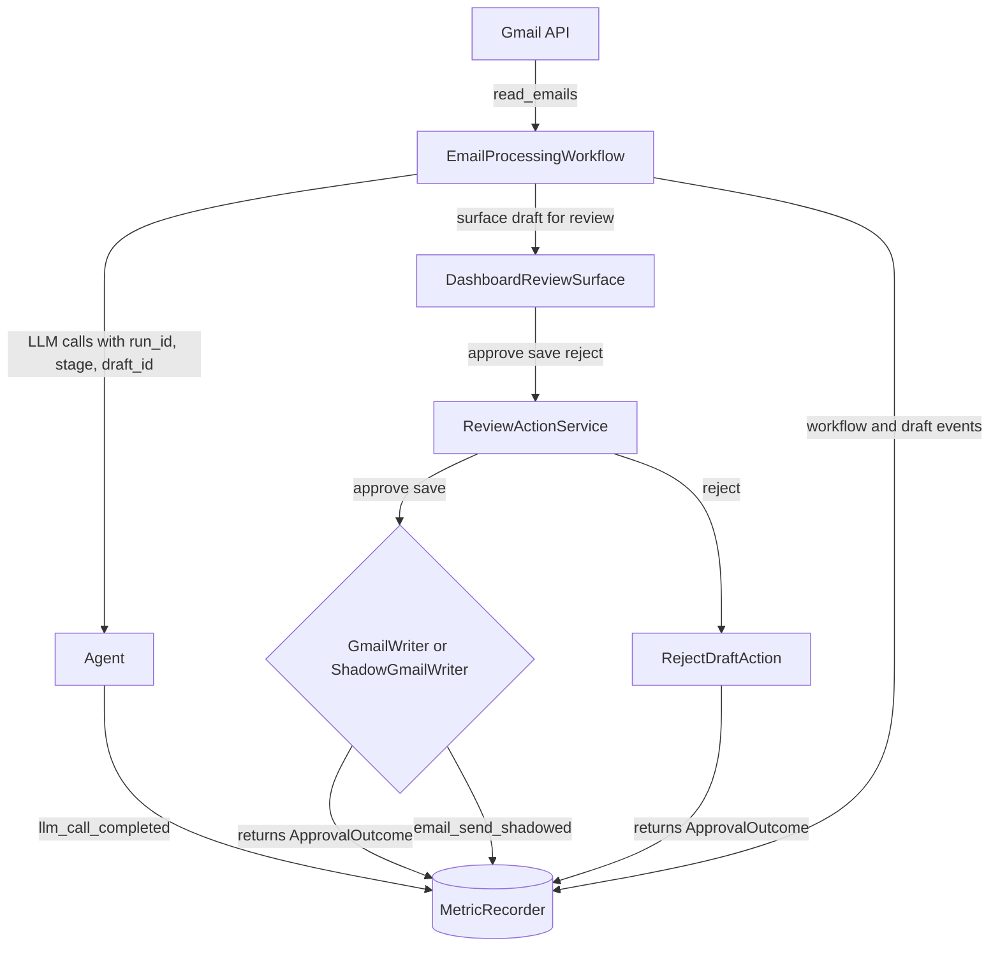

# 001 — Dashboard HITL Surface

**Status:** Proposed
**Date:** 2026-06-23

---

## Context

Inbox0 started with Slack as the human-in-the-loop review surface: the agent reads email, drafts replies, and asks the user to approve, save, or reject each draft from Slack. That was a good prototype surface because Slack made review fast to ship and easy to test without building a frontend.

For v1.0, Slack is no longer the preferred product-facing destination. The project needs a browser-native surface that demonstrates the full system as an application: email ingestion, agent reasoning, draft generation, human review, and safe approval. Slack remains useful as a legacy fallback and proof of integration, but the portfolio demo should center on the dashboard.

This ADR scopes the first dashboard as a **review console**, not a full inbox replacement or analytics product. The goal is to replace Slack for the core demo path while keeping the frontend small enough to ship alongside eval, shadow mode, classifier, and RAG work.

---

## Goals

1. Give the user a browser-native place to review agent-created drafts before any outbound email is sent.
2. Show the high-level summary of the emails the agent read during the current workflow run.
3. Show enough source email context for the user to judge whether the draft is grounded.
4. Wire approve, save, and reject actions to the same backend review-action boundary used by shadow mode.
5. Use a modern TypeScript frontend stack with enough polish to be credible in a portfolio demo.

## Non-goals

- Replacing Gmail as a full inbox browser.
- Multi-user auth, account management, or OAuth login in the frontend.
- Full thread browsing, search, filters, labels, or mailbox management.
- Analytics dashboards for send rate, edit distance, cost, or latency.
- WebSockets or real-time collaboration.
- Hosted SaaS deployment.
- Rebuilding Slack feature parity before the browser path works.

---

## Decision

Build a minimal TypeScript dashboard as Inbox0's primary v1.0 human-in-the-loop surface. The first version is a single-page review console with three regions:

1. **Workflow summary** — status of the current run and a high-level summary of emails read.
2. **Draft review card** — the current draft plus approve, save, and reject actions.
3. **Source context** — the most recent email being answered, with room to expand into full thread and RAG citation views later.

The dashboard is the canonical review surface for v1.0. Slack remains available as a fallback integration, but new product and evaluation work should optimize the browser path first.

---

## Recommended Stack

- **Vite** for a small frontend app with minimal framework overhead.
- **React** for component structure and hiring-market familiarity.
- **TypeScript** for frontend correctness and resume signal.
- **Node.js tooling** via the frontend package manager and dev server.
- **Tailwind CSS** for fast, credible UI polish without a large custom design system.
- **TanStack Query** later if polling and mutation state become messy; avoid adding it until the API surface needs it.

Avoid Next.js for the first cut. Server-side rendering, app routing, and deployment conventions are not needed for the v1.0 review console and would increase scope before the product path is proven.

---

## Minimal User Flow




The browser path should be:

1. User opens the dashboard.
2. User starts a workflow run.
3. Dashboard shows workflow status and email summary.
4. If a draft is ready, dashboard shows the draft review card.
5. Dashboard shows the most recent source email being answered.
6. User clicks `Approve & Send`, `Save Draft`, or `Reject`.
7. Backend records the review action and advances the workflow.
8. Dashboard shows the next draft or a completed state.

---

## MVP UI

### Workflow Summary

Shows what the agent read and decided.

Minimum fields:

- Workflow run ID.
- Run status: `idle`, `running`, `awaiting_review`, `completed`, or `error`.
- Count of unread emails read.
- Count of drafts created.
- High-level email summary generated by the agent.
- Final workflow summary when complete.

This panel answers: **What did the agent see?**

### Draft Review Card

Shown only when a draft is awaiting user review.

Minimum fields:

- Recipient or original sender.
- Subject.
- Generated draft body.
- Current draft index, if multiple drafts exist.
- Action buttons: `Approve & Send`, `Save Draft`, `Reject`.

This panel answers: **What is the agent about to do, and can I control it?**

### Source Context

For the first version, show the most recent inbound email that the draft is answering.

Minimum fields:

- Sender.
- Timestamp, if available.
- Subject.
- Body snippet or body text.
- Thread ID or email ID for traceability.

Future versions can add:

- Collapsible full thread.
- Retrieved RAG context.
- Citation snippets.
- "Why this draft?" explanation.

This panel answers: **Is the draft grounded in the right conversation?**

---

## API Shape

The dashboard needs a small backend API. Exact route names can change during implementation, but the product contract should stay stable.

### Start workflow

`POST /start_workflow`

Starts the current Inbox0 workflow and returns the initial run state.

### Get workflow state

`GET /workflow/{workflow_run_id}`

Returns:

- `workflow_run_id`
- `status`
- `email_summary`
- `current_draft`
- `current_source_email`
- `current_draft_index`
- `total_drafts`
- `final_summary`
- `error`

### Review current draft

`POST /workflow/{workflow_run_id}/review`

Body:

```json
{
  "draft_id": "draft_123",
  "action": "approve"
}
```

Allowed actions:

- `approve`
- `save`
- `reject`

Returns an `ApprovalOutcome` and the next workflow state.

This route should call the same `ReviewActionService` described in `docs/decisions/evaluation/002-shadow_mode.md`, so dashboard actions, shadow mode, metric recording, and Slack fallback use one shared approval boundary.

---

## Relationship To Shadow Mode

The dashboard and shadow mode should be designed together:

- The dashboard is where the user expresses review intent.
- `ReviewActionService` turns that intent into approve/save/reject behavior.
- `GmailWriter` performs live Gmail writes.
- `ShadowGmailWriter` no-ops the same write paths when `INBOX0_SHADOW_MODE=true`.
- `MetricRecorder` records the same review-domain events regardless of live or shadow mode.

This keeps evaluation instrumentation attached to product semantics rather than UI-specific behavior.

---

## Deferred

- Full inbox replacement.
- Full thread expand/collapse.
- RAG citation panel, unless minimal RAG lands before the dashboard is complete.
- Eval metrics dashboard.
- Cost and latency charts.
- User settings.
- Authentication UI.
- WebSockets or server-sent events.
- Production deployment.

---

## Acceptance Criteria

- User can start a workflow from the browser.
- User can see the current workflow status.
- User can see the high-level summary of emails read.
- User can review a generated draft in the browser.
- User can see the most recent source email for that draft.
- User can approve, save, or reject the draft from the browser.
- Browser actions call the shared backend review-action boundary.
- Slack is not required for the primary demo path.

---

## Open Questions

1. Should the first dashboard poll workflow state, or should the backend return enough state from each action to avoid polling? Default: start with simple polling or manual refresh, avoid WebSockets.
2. Should shadow-mode labels appear in the dashboard as `Would Send`, `Would Save Draft`, and `Would Reject`? Default: yes, to match the semantics in `002-shadow_mode.md`.
3. Should the dashboard show raw JSON for debugging in the first version? Default: yes behind a collapsible debug section, because it helps portfolio demos and development.
